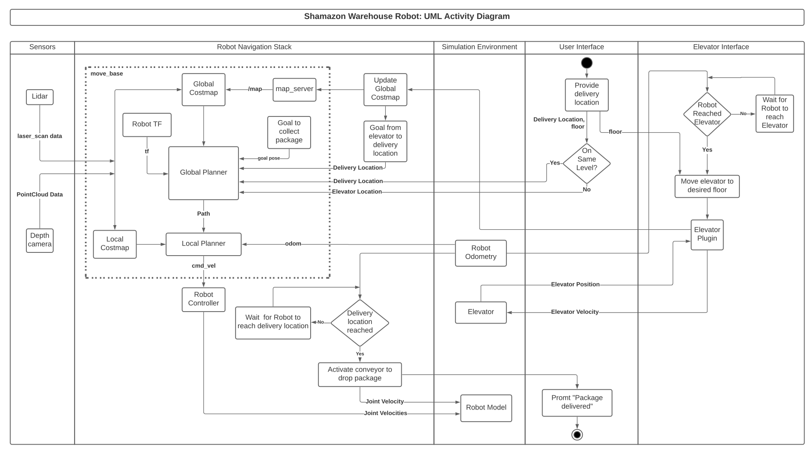

# Shamazon_Warehouse_Robot
[](https://opensource.org/licenses/BSD-3-Clause)

## Overview
The project demonstrates a delivery robot with autonomous capabilities, static, and dynamic obstacle avoidance. The robot will navigate to a conveyor belt to receive a package and will navigate through a map to deliver it between departments inside a warehouse with multiple levels, the robot can use elevator gazebo plugin to communicate, know the state and location of the elevator, and upon reaching the desired level/ floor, update the map. Finally, on reaching the goal the package will be delivered by the robot’s conveyor belt.

During the development the following assumptions
are made:
- Package collection and delivery locations are known.
- Map has been generated and is known to the robot.
- Robot drive configuration - 4 wheel differential drive.
- Robot carries only 1 package at a time.
- Package dimensions are fixed.

## [Presentation Video link](https://drive.google.com/file/d/1NzI3LVkqqi4rIJxv15HFPzumJXbBZcDZ/view?usp=sharing)

## Project Technologies:
- Operating System: Ubuntu 18.04
- Build tool: catkin_make
- Version control: GitHub
- Software Tools: VS Code
- Build Check: Travis
- Code Coverage: Coveralls
- Framework: ROS Melodic
- Simulator: Gazebo (version 9+)
- Open-source libraries/ packages: [ROS Navigation stack](https://github.com/ros-planning/navigation/tree/melodic-devel), [ gazebo_ros_pkgs](https://github.com/ros-simulation/gazebo_ros_pkgs/tree/melodic-devel), [ pgm_map_creator](https://github.com/hyfan1116/pgm_map_creator), [ multimap_server](https://github.com/RobotnikAutomation/multimap_server
).

## Deliverables
- Project: A simulation of Autonomous Warehouse Robot to deliver packages.
- Dynamic/Static obstacle avoidance.
- UML Diagrams.
- Developer level documentation.
- Additon of Coveralls for code coverage and Travis for package build check.

## Risk and Mitigations
- Odometry error: Can use sensor fusion algorithms from multiple sensors for odometry data.
- A package might fall off due to sudden jerks, so robot velocity and acceleration will be constrained.

## Architecture:
The following shows the activity diagram for our proposed schema :  
  
## UML Diagrams:
- ### [Activity Diagram](UML/final/ActivityDiagram.pdf)
- ### [Class Diagram](UML/final/ClassDiagram.pdf)

## [Quad Chart](/quadchart.pdf)  

## Agile Iterative Process (AIP) 
The general idea is to split the development of the software into sequences of repeated cycles (iterations).  
Following is the link to sheet that contains the detailed entries of the  product backlog, iteration backlog, and work log- [link](https://docs.google.com/spreadsheets/d/18Xq4BVFL68C6Wvr2qXAJ81NjCmKPvWJj-AAwVcG0ChA/edit#gid=0)

## Sprint Planning and Review
The purpose of sprint planning is to define what can be delivered in the sprint and how that work will be achieved.  
Following is the link to doc for sprint planning and review - [link](https://docs.google.com/document/d/1AmzMY3f8XwVzfqlMO0ibq1iekdNcpcQLZXXCRKqJ8bo/edit)


## Dependencies

- **Ubuntu 18.04**
- **ROS Melodic** 


## Building and Running the package
1. Clone the Shamazon Robot Package in src folder of your workspace:
    ```bash
    cd ~/<your_ws>/src
    git clone https://github.com/maitreya1698/shamazon_robot.git
    ```
2. Two additional repos need to be cloned into the src folder of workspace:
    ```bash
    cd ~/<your_ws>/src
    git clone https://github.com/Prat33k-dev/multimap_server_msgs
    git clone https://github.com/Prat33k-dev/multimap_server
    ```
3. Install ROS dependencies:
    ```bash
    cd ~/<your_ws>
    rosdep install --from-paths src --ignore-src -r -y
    ```
4. Building and running the package:
    ```bash
    cd ~/<your_ws>
    catkin_make
    source devel/setup.bash
    roslaunch shamazon_robot gazebo.launch
    ```
5. To start simulation node (In another terminal) :
    ```bash
    cd ~/<your_ws>
    source devel/setup.bash
    rosrun shamazon_robot shamazon_robot
    ```
## Simulation Result
  
  
  
## Running Tests
  ```bash
cd ~/<your_ws>
catkin_make
source devel/setup.bash
catkin_make run_tests_shamazon_robot
```  

## Cppcheck and Cpp lint
* The Output txt files will be saved under results folder  

For cppcheck

```bash
sh run_check.sh 
```

For cpplint
```bash
sh run_cpplint.sh 
```

## Authors
- Pratik Bhujbal  UID: 117555295   
  Github URL: https://github.com/prat33k-dev

- Maitreya Kulkarni UID: 117506075  
  Github URL: https://github.com/maitreya98
  
- Maaruf Vazifdar UID: 117509717  
  Github URL: https://github.com/maarufvazifdar

## License
The 3-Clause BSD License
```
Copyright (c) 2021 Pratik Bhujbal, Mohammed Maaruf Vazifdar, Maitreya Kulkarni.
Redistribution and use in source and binary forms, with or without modification, are permitted provided that the following conditions are met:
1. Redistributions of source code must retain the above copyright notice, this list of conditions and the following disclaimer.
2. Redistributions in binary form must reproduce the above copyright notice, this list of conditions and the following disclaimer in the documentation and/or other materials provided with the distribution.
3. Neither the name of the copyright holder nor the names of its contributors may be used to endorse or promote products derived from this software without specific prior written permission.
THIS SOFTWARE IS PROVIDED BY THE COPYRIGHT HOLDERS AND CONTRIBUTORS "AS IS" AND ANY EXPRESS OR IMPLIED WARRANTIES, INCLUDING, BUT NOT LIMITED TO, THE IMPLIED WARRANTIES OF MERCHANTABILITY AND FITNESS FOR A PARTICULAR PURPOSE ARE DISCLAIMED. IN NO EVENT SHALL THE COPYRIGHT HOLDER OR CONTRIBUTORS BE LIABLE FOR ANY DIRECT, INDIRECT, INCIDENTAL, SPECIAL, EXEMPLARY, OR CONSEQUENTIAL DAMAGES (INCLUDING, BUT NOT LIMITED TO, PROCUREMENT OF SUBSTITUTE GOODS OR SERVICES; LOSS OF USE, DATA, OR PROFITS; OR BUSINESS INTERRUPTION) HOWEVER CAUSED AND ON ANY THEORY OF LIABILITY, WHETHER IN CONTRACT, STRICT LIABILITY, OR TORT (INCLUDING NEGLIGENCE OR OTHERWISE) ARISING IN ANY WAY OUT OF THE USE OF THIS SOFTWARE, EVEN IF ADVISED OF THE POSSIBILITY OF SUCH DAMAGE.
```

